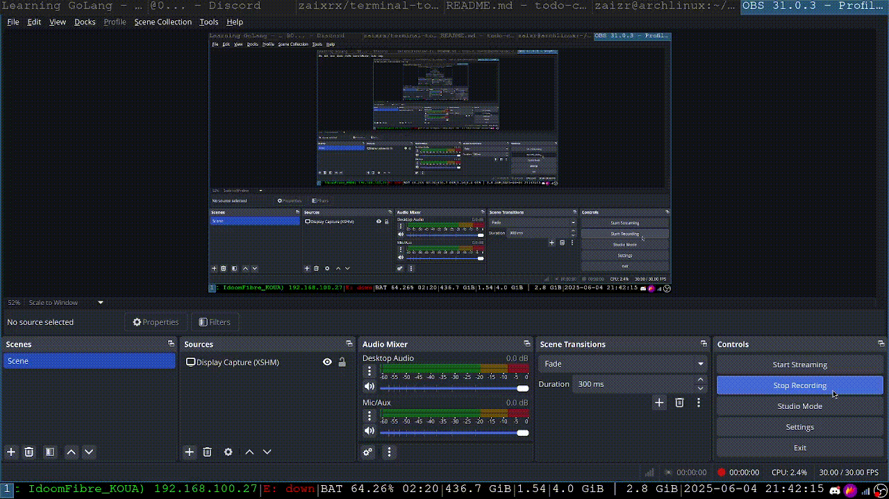

# Terminal TODO App (Go)

A simple terminal TODO app built as a first project to learn Go.



## Features

- Add, view, and mark TODOs as done
- Save/load TODOs from a JSON file
- Text-based UI using [tview](https://github.com/rivo/tview)

## Build & Run

```bash
go build -o todo
./todo [optional-json-path]
```
